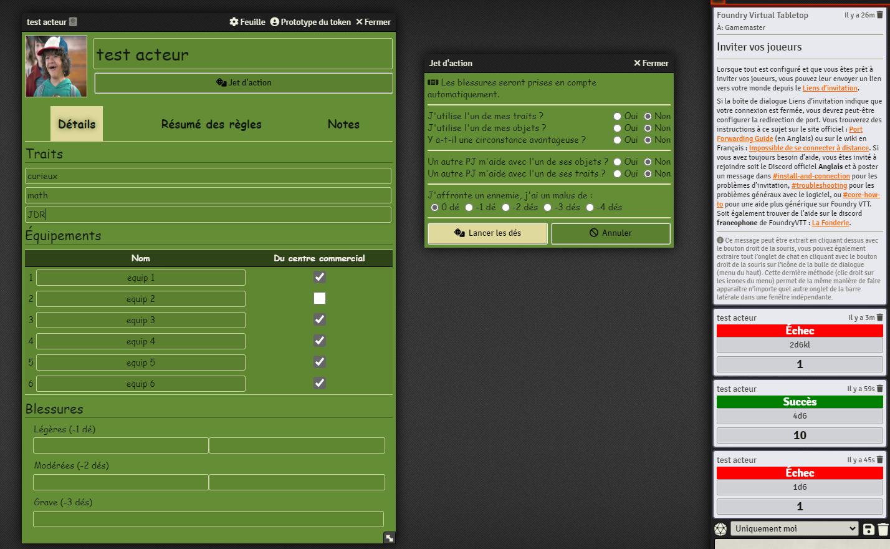

# Système FoundryVTT pour Green Dawn Mall

## Green Dawn Mall
[Green Dawn Mall](https://comemartin.itch.io/green-dawn-mall) est un JDR de [Côme Martin](https://comemartin.itch.io/) permettant de vivre une aventure en tant qu'adolescent•e•s perdus dans un centre commercial très étrange à la recherche de leur ami•e.

## Le système

Le système propose une fiche de PJ avec une aide au lancé des dès.
Classiquement le PJ on une photo et un nom que l'on retrouve en entête.

### bouton jet d'action
Le bouton _Jet d'action_ est une aide au lancé de dès sous forme d'un petit questionnaire ce qui va permettre de déterminer le nombre de dès à lancer.

Quelques précision sur le calcul du nombre de dès :
- ça prend en compte automatiquement les blessures.
- il ne peux pas y avoir plus de 4d6
- en cas d'un nombre de dès négatif, on lance 2d6 en ne gardant que le plus faible résultat (2d6kl)

Les résultats du lancé de dès apparait dans la fenêtre de chat avec un _Succès_ vert s'il y a un 5 ou un 6, _Échec_ rouge sinon.

### onglet détail
Dans cet onglet il est possible de saisir les 3 traits du PJ et les 6 équipements possible.
A noter qu'il y a une case à cocher pour aider à se souvenir si l'objet vient du centre ou non.
Et enfin il y a la partie pour les blessures.

### onglet résumé des règles
Cet onglet reprends les règles présent sur la fiche papier du jeu.

### onglet notes
Une section permettant de prendre des notes en cours de partie.
A noter qu'il faut passer au dessus de la section de texte pour faire apparaitre le bouton de dévérouillage.
La sauvegarde est automatique.

## Ce qui n'est pas géré par le système 
- Il n'y a pas de génération de place/magasin/rencontre
- Il n'y a pas de fiche pour un _PJ étrange_
- Les objets ne se cassent pas automatiquement